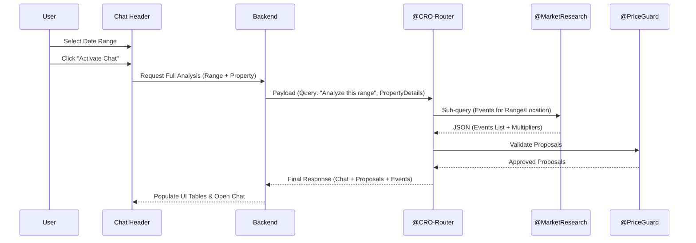

# Implementation Plan - Chat Activation & Event Analysis

This plan outlines the updates to the PriceOS agent system to support the "Chat Activate" workflow, where selecting a date range triggers a comprehensive market and pricing analysis.

## User Review Required
> [!IMPORTANT]
> The "Event Factor" (e.g., 0.73x) will be calculated by `@MarketResearch` based on historical demand for similar events. We need to confirm if this factor should be a direct multiplier for the `base_price` or a weight used by the Router.

## Proposed Changes

### 1. Agent Prompts (`updated_prompts/`)

#### [MODIFY] [01-cro-router.md](file:///Users/rohithp/Desktop/Agent_preneur/priceos-latest2/priceos/updated_prompts/01-cro-router.md)
*   **Input Update**: Add `selected_date_range` to the backend JSON schema.
*   **Mandatory Filtering**: Instruction to pass the range to all sub-agents.
*   **Activation Intent**: Handle the "Activate Chat" trigger specifically.

#### [MODIFY] [04-market-research.md](file:///Users/rohithp/Desktop/Agent_preneur/priceos-latest2/priceos/updated_prompts/04-market-research.md)
*   **Factor Output**: Add `price_multiplier` to the `events` array schema.
*   **Search Constraint**: Instructions to strictly search within `selected_date_range`.

#### [MODIFY] [02-property-analyst.md](file:///Users/rohithp/Desktop/Agent_preneur/priceos-latest2/priceos/updated_prompts/02-property-analyst.md) & [03-booking-intelligence.md](file:///Users/rohithp/Desktop/Agent_preneur/priceos-latest2/priceos/updated_prompts/03-booking-intelligence.md)
*   **SQL Strictness**: Explicitly mandate `WHERE date BETWEEN start AND end` for all table queries.

### 2. UI & Interaction Flow

- **Header Update**: Add Date Range Picker + "Setup" Button + "Activate Chat" Toggle.
- **Table Population**: 
    - **Events Table**: Populated by `@MarketResearch`.
    - **Proposals Table**: Populated by `@PriceGuard` (after Router/Analyst/Intelligence processing).

## Data Flow Diagram

## Verification Plan
### Automated Tests
- Schema validation for `@MarketResearch` to ensure `price_multiplier` is present.
- Mock router call with a date range to verify parallel sub-agent invocation.

